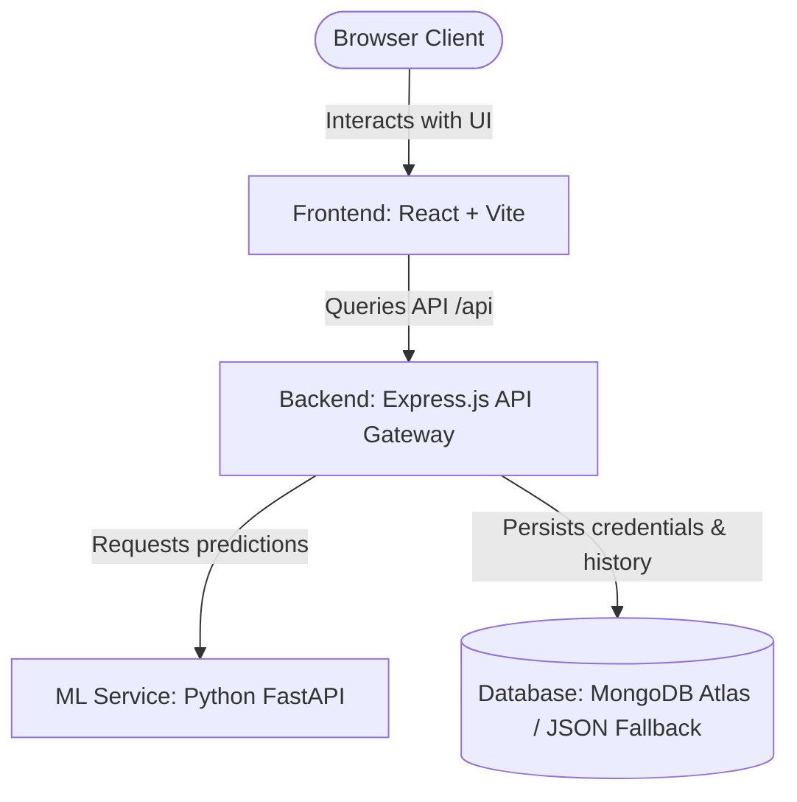

# FlatVision.AI Deployment Guide

This guide provides step-by-step instructions to deploy the entire FlatVision.AI stack to production.

---

## Architecture Overview

- **Frontend** (React/Vite): Deployed on **Vercel**.
- **Backend** (Node.js/Express): Deployed on **Render** (Web Service).
- **ML Service** (Python/FastAPI): Deployed on **Render** (Web Service).
- **Database**: **MongoDB Atlas** (Recommended for production persistence) or local `db.json` fallback.

---

## Phase 1: Deploy the ML Service (FastAPI) on Render

First, deploy the machine learning microservice so the backend has a URL to connect to.

1. **Sign In**: Log into your [Render Dashboard](https://dashboard.render.com).
2. **New Service**: Click **New +** and select **Web Service**.
3. **Connect Repository**: Connect your GitHub repository containing the project.
4. **Configuration Settings**:
   - **Name**: `flatvision-ml`
   - **Environment**: `Python`
   - **Root Directory**: `ml` *(Crucial: This tells Render to compile from the `ml/` subfolder)*
   - **Build Command**: `pip install -r requirements.txt`
   - **Start Command**: `python -m uvicorn app:app --host 0.0.0.0 --port $PORT`
5. **Instance Type**: Select **Free** (or your preferred tier).
6. **Deploy**: Click **Create Web Service**.
7. **Retrieve URL**: Once active, copy the generated service URL (e.g. `https://flatvision-ml.onrender.com`).

---

## Phase 2: Deploy the Backend API (Node.js) on Render

Next, deploy the backend server that manages authentication and routes predictions.

1. **New Service**: Click **New +** and select **Web Service**.
2. **Connect Repository**: Connect your GitHub repository.
3. **Configuration Settings**:
   - **Name**: `flatvision-backend`
   - **Environment**: `Node`
   - **Root Directory**: `backend` *(Crucial: This tells Render to compile from the `backend/` subfolder)*
   - **Build Command**: `npm install`
   - **Start Command**: `node server.js`
4. **Add Environment Variables**: Under the **Environment** tab, click **Add Environment Variable** and define:
   
   | Key | Value | Description |
   | :--- | :--- | :--- |
   | `PORT` | `10000` | Port for the backend service |
   | `MONGO_URI` | `mongodb+srv://...` | *Highly Recommended:* Your MongoDB Atlas connection string. (If omitted, the backend will auto-fallback to `db.json` storage, but records will clear when the Render instance sleeps/restarts) |
   | `JWT_SECRET` | `your_long_random_secure_secret_key` | Secret key for signing user tokens |
   | `ML_SERVICE_URL` | `https://flatvision-ml.onrender.com` | The Render service URL you copied from **Phase 1** |
   | `FRONTEND_URL` | `https://flatvision-ai.vercel.app` | The Vercel URL where your frontend will live (you will update this in Phase 3) |

5. **Deploy**: Click **Create Web Service**.
6. **Retrieve URL**: Once active, copy the generated backend URL (e.g. `https://flatvision-backend.onrender.com`).

---

## Phase 3: Deploy the Frontend (React + Vite) on Vercel

Finally, deploy your React frontend to Vercel and hook it up to the Render backend.

1. **Sign In**: Log into your [Vercel Dashboard](https://vercel.com).
2. **Import Project**: Click **Add New** -> **Project**, and select your GitHub repository.
3. **Configuration Settings**:
   - **Project Name**: `flatvision-ai`
   - **Framework Preset**: `Vite`
   - **Root Directory**: Click Edit, select the `frontend` folder, and confirm.
4. **Configure Environment Variables**: Expand the **Environment Variables** section and add:

   | Key | Value | Description |
   | :--- | :--- | :--- |
   | `VITE_API_BASE_URL` | `https://flatvision-backend.onrender.com/api` | The Render backend API URL copied in **Phase 2** (appended with `/api`) |
   | `VITE_CLERK_PUBLISHABLE_KEY` | `pk_test_...` | Your Clerk auth key (optional if using database authentication) |

5. **Deploy**: Click **Deploy**.
6. **Final Step**: Copy the Vercel URL (e.g., `https://flatvision-ai.vercel.app`) and add/update it as the `FRONTEND_URL` in your Render backend settings so CORS allows requests.

---

## Troubleshooting & Verification

- **Check Logs**: If predictions fail, view Render log outputs in both the `flatvision-backend` and `flatvision-ml` dashboards.
- **Spin-up Delay**: Free services on Render "spin down" after 15 minutes of inactivity. When visiting the website for the first time in a while, requests may take 30-50 seconds to respond as the containers wake up.
