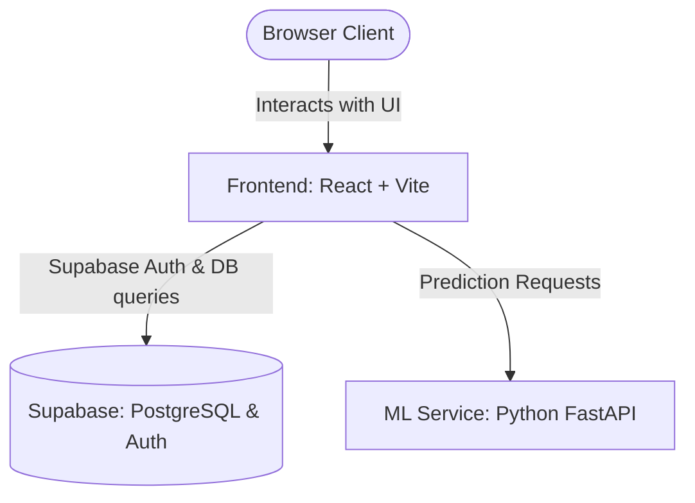

# FlatVision.AI Deployment Guide

This guide provides step-by-step instructions to deploy the entire FlatVision.AI stack to production using a serverless architecture.

---

## Architecture Overview

- **Frontend** (React/Vite): Deployed on **Vercel** or **Netlify**.
- **Backend/Database**: **Supabase** (Handles Authentication and PostgreSQL Database).
- **ML Service** (Python/FastAPI): Deployed on **Render** (Web Service).

---

## Phase 1: Set up Supabase (Auth & Database)

1. **Sign In**: Log into your [Supabase Dashboard](https://supabase.com/dashboard).
2. **New Project**: Create a new project and configure your database password.
3. **Database Schema**: Go to the SQL Editor in your new project and run the provided schema (located in `supabase_schema.sql` at the project root) to create the `predictions` table and apply Row-Level Security (RLS) policies.
4. **Authentication**: Supabase Email/Password authentication is enabled by default. You do not need additional setup for basic auth.
5. **API Keys**: Go to **Project Settings -> API**. Copy your **Project URL** and **anon public** API key. You will need these for the frontend.

---

## Phase 2: Deploy the ML Service (FastAPI) on Render

Deploy the machine learning microservice so the frontend has a URL to connect to.

1. **Sign In**: Log into your [Render Dashboard](https://dashboard.render.com).
2. **New Service**: Click **New +** and select **Web Service**.
3. **Connect Repository**: Connect your GitHub repository containing the project.
4. **Configuration Settings**:
   - **Name**: `flatvision-ml`
   - **Environment**: `Python`
   - **Root Directory**: `ml` *(Crucial: This tells Render to compile from the `ml/` subfolder)*
   - **Build Command**: `pip install -r requirements.txt`
   - **Start Command**: `python -m uvicorn app:app --host 0.0.0.0 --port $PORT`
5. **Instance Type**: Select **Free** (or your preferred tier).
6. **Deploy**: Click **Create Web Service**.
7. **Retrieve URL**: Once active, copy the generated service URL (e.g. `https://flatvision-ml.onrender.com`).

---

## Phase 3: Deploy the Frontend (React + Vite) on Vercel

Finally, deploy your React frontend to Vercel and hook it up to Supabase and the Render ML Service.

1. **Sign In**: Log into your [Vercel Dashboard](https://vercel.com).
2. **Import Project**: Click **Add New** -> **Project**, and select your GitHub repository.
3. **Configuration Settings**:
   - **Project Name**: `flatvision-ai`
   - **Framework Preset**: `Vite`
   - **Root Directory**: Click Edit, select the `frontend` folder, and confirm.
4. **Configure Environment Variables**: Expand the **Environment Variables** section and add:

   | Key | Value | Description |
   | :--- | :--- | :--- |
   | `VITE_SUPABASE_URL` | `https://your-project-id.supabase.co` | The Supabase Project URL from **Phase 1** |
   | `VITE_SUPABASE_ANON_KEY` | `eyJhb...` | The Supabase anon public key from **Phase 1** |
   | `VITE_ML_SERVICE_URL` | `https://flatvision-ml.onrender.com` | The Render service URL you copied from **Phase 2** |

5. **Deploy**: Click **Deploy**.
6. **Final Step**: Once deployed, the frontend should now securely authenticate users with Supabase, store predictions in the PostgreSQL database, and get real-time price valuations from the FastAPI Python service!

---

## Troubleshooting & Verification

- **Check Logs**: If predictions fail, view Render log outputs in the `flatvision-ml` dashboard.
- **Spin-up Delay**: Free services on Render "spin down" after 15 minutes of inactivity. When visiting the website for the first time in a while, requests may take 30-50 seconds to respond as the containers wake up.
- **Auth Errors**: Verify that your `VITE_SUPABASE_URL` and `VITE_SUPABASE_ANON_KEY` environment variables are properly set in Vercel.
